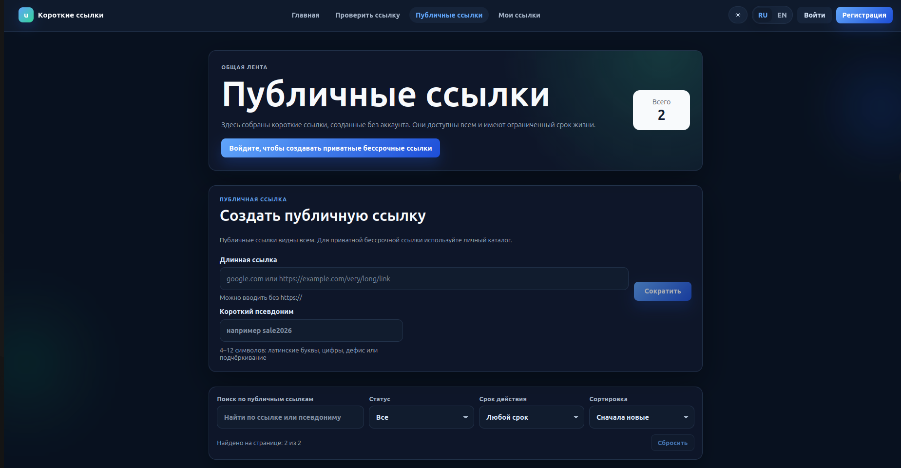

# URL-Shortener

`URL-Shortener` - fullstack pet project для создания коротких ссылок, управления личными и публичными ссылками и анализа переходов. Проект доведен до production-состояния: frontend, API и short redirects работают на одном домене, HTTPS и routing обслуживает Caddy, backend запускается через Docker Compose.

**Live demo:** [https://link-go.ru](https://link-go.ru)

Ключевые возможности: short links, custom aliases, auth, dashboard, public links, link statistics, click history, Google Safe Browsing check, one-domain production routing и reserved aliases для служебных путей.

## Скриншоты

| Публичные ссылки | Каталог пользователя |
| --- | --- |
|  |  |
| Проверка ссылки | Аналитика ссылки |
|  |  |
| Настройки аккаунта | |
|  | |

### Мобильная версия

<table>
  <tr>
    <td align="center"><strong>Публичные ссылки</strong></td>
    <td align="center"><strong>Меню</strong></td>
    <td align="center"><strong>Настройки аккаунта</strong></td>
  </tr>
  <tr>
    <td></td>
    <td></td>
    <td></td>
  </tr>
</table>

## Возможности

- Создание коротких ссылок с автоматическим кодом или custom alias.
- Публичные ссылки без авторизации и приватные ссылки, привязанные к пользователю.
- Регистрация, вход, refresh tokens, logout и отзыв всех токенов.
- Личный кабинет со списком ссылок пользователя.
- Управление ссылками: alias, активность, срок действия, удаление.
- Статистика переходов: total clicks, страны, устройства, даты.
- История кликов: время, страна, user agent, обфусцированный IP.
- Проверка URL при создании: доступность URL и Google Safe Browsing.
- Redis cache для redirect lookup с fallback на PostgreSQL.
- Rate limiting для публичных и авторизованных запросов.
- Reserved aliases защищают `/api`, `/assets`, `/dashboard`, `/public`, `/login`, `/links` и другие служебные пути.

## Tech Stack

| Layer | Stack |
| --- | --- |
| Backend | Python 3.13, FastAPI, Pydantic, SQLAlchemy async, Alembic, dependency-injector, slowapi, structlog, httpx |
| Frontend | Vite, React, TypeScript, React Router, Recharts |
| Database/Cache | PostgreSQL 16, Redis 7 |
| Infrastructure | Docker, Docker Compose, Caddy 2, automatic HTTPS certificates |
| Testing/Quality | pytest, pytest-asyncio, httpx ASGITransport, factory_boy, ruff, TypeScript build |

## Архитектура

```text
src/
  api/                 FastAPI routers, schemas, dependencies
  domain/              Domain models, exceptions, repository interfaces
  usecases/            Application use cases for links, users and tokens
  infrastructure/      PostgreSQL repositories, Redis cache, DB session
  migrations/          Alembic migrations
  services/            URL validation, Safe Browsing, geo helpers
frontend/
  src/                 Vite + React + TypeScript application
build/                 Dockerfiles and Docker Compose files
deploy/                Caddy production routing
tests/                 Unit, integration and smoke tests
config/                App config and local/test env templates
```

Backend придерживается слоистой структуры: API вызывает use cases, use cases работают с domain abstractions, а PostgreSQL/Redis реализации находятся в `src/infrastructure/`.

## Основные маршруты

- **Frontend routes:** `/`, `/dashboard`, `/public`, `/check`, `/account`, `/login`, `/register`, `/links/:shortUrl`, `/404`.
- **Backend API:** `/api/v1/auth/*`, `/api/v1/user/*`, `/api/v1/link/*`, `/public`.
- **Short redirects:** `/{short_url}` redirect'ит на исходный URL и записывает click event.
- **Docs:** `/docs`, `/openapi.json`, `/redoc`.

## Проверки

```bash
ruff check src/
pytest -q
```

```bash
cd frontend
npm run build
```

В `frontend/package.json` нет отдельного `lint` или `typecheck` script. TypeScript проверяется командой `npm run build`.

<details>
<summary>Локальный запуск проекта</summary>

### Backend

Требования: Python 3.13, PostgreSQL, Redis.

```bash
python3.13 -m venv .venv
source .venv/bin/activate
pip install -r requirements.txt
```

Создайте локальный env-файл:

```bash
cp config/.env.example config/.env
```

Если PostgreSQL и Redis запускаются через local Docker Compose, поднимите dev-инфраструктуру:

```bash
docker compose -f build/docker-compose.yml up -d db redis
```

В этом случае в `config/.env` используйте host-подключение к опубликованным портам:

```text
DB_HOST=localhost
DB_PORT=5433
REDIS_URL=redis://localhost:6379/0
```

Примените миграции:

```bash
make up
```

Запустите backend:

```bash
cd src
uvicorn app:app --reload
```

Backend будет доступен на `http://localhost:8000`.

### Frontend

```bash
cd frontend
cp .env.example .env
npm ci
npm run dev
```

Frontend dev server работает на `http://localhost:5173`.

`frontend/.env`:

```text
VITE_API_BASE_URL=http://localhost:8000
```

Production build frontend:

```bash
cd frontend
npm run build
```

</details>

<details>
<summary>Production deploy на VPS</summary>

Production setup:

- `build/docker-compose.prod.yml` - Caddy, backend, PostgreSQL и Redis.
- `deploy/Caddyfile` - HTTPS reverse proxy и маршрутизация SPA/API/short links.
- `frontend/Dockerfile` - Vite build stage и Caddy static image.
- `.env.prod.example` - шаблон production env.

Требования: Ubuntu server, Docker, Docker Compose plugin, открытые порты `80` и `443`.

DNS должен указывать оба имени на IP сервера:

```text
A @   -> <SERVER_IP>
A www -> <SERVER_IP>
```

Создайте production env:

```bash
cp .env.prod.example .env.prod
```

Для `link-go.ru` основные значения должны быть согласованы:

```text
DOMAIN=link-go.ru
APP_FRONTEND_BASE_URL=https://link-go.ru
APP_CORS_ORIGINS=https://link-go.ru
VITE_API_BASE_URL=https://link-go.ru
```

Секреты, API keys и database password в `.env.prod` должны быть заменены на реальные production значения.

Запуск:

```bash
docker compose -f build/docker-compose.prod.yml --env-file .env.prod up -d --build
```

Миграции:

```bash
docker compose -f build/docker-compose.prod.yml --env-file .env.prod run --rm backend alembic upgrade head
```

Логи:

```bash
docker compose -f build/docker-compose.prod.yml --env-file .env.prod logs -f
```

Остановка:

```bash
docker compose -f build/docker-compose.prod.yml --env-file .env.prod down
```

Обновление после `git pull`:

```bash
git pull
docker compose -f build/docker-compose.prod.yml --env-file .env.prod up -d --build
docker compose -f build/docker-compose.prod.yml --env-file .env.prod run --rm backend alembic upgrade head
```

Production routing:

- `link-go.ru` обслуживает frontend SPA.
- `www.link-go.ru` постоянно редиректит на `https://link-go.ru{uri}`.
- `/api/v1/*`, `/docs`, `/openapi.json`, `/redoc` проксируются в backend.
- Frontend routes идут в SPA fallback.
- Остальные неизвестные пути идут в backend как short links `/{short_url}`.
- Caddy автоматически получает и обновляет HTTPS certificates.

</details>

<details>
<summary>Env variables</summary>

### Production `.env.prod`

| Variable | Назначение |
| --- | --- |
| `DOMAIN` | Основной production домен без схемы. |
| `APP_DEBUG` | Debug mode backend. В production должен быть `false`. |
| `APP_FRONTEND_BASE_URL` | Публичный base URL frontend. |
| `APP_CORS_ORIGINS` | Разрешенные CORS origins. |
| `VITE_API_BASE_URL` | Base URL, который frontend использует для API и short links. |
| `APP_SECRET_KEY` | Backend secret. |
| `APP_SAFE_BROWSING_API_KEY` | Google Safe Browsing API key. |
| `DB_NAME` | Имя PostgreSQL database. |
| `DB_USER` | Пользователь PostgreSQL. |
| `DB_PASSWORD` | Пароль PostgreSQL. |
| `REDIS_URL` | Redis connection URL. |

В production compose `DB_NAME`, `DB_USER` и `DB_PASSWORD` передаются в PostgreSQL container как `POSTGRES_DB`, `POSTGRES_USER` и `POSTGRES_PASSWORD`. `DB_HOST` и `DB_PORT` для backend задаются compose-файлом как `postgres` и `5432`.

### Local/Test

| Variable | Назначение |
| --- | --- |
| `DB_HOST` | Host PostgreSQL для локального backend. |
| `DB_PORT` | Port PostgreSQL для локального backend. |
| `POSTGRES_USER` | Пользователь PostgreSQL container в local Docker Compose. |
| `POSTGRES_PASSWORD` | Пароль PostgreSQL container в local Docker Compose. |
| `POSTGRES_DB` | Database PostgreSQL container в local Docker Compose. |
| `DATABASE_URL` | Test database URL для `tests/conftest.py`. |
| `REDIS_URL` | Redis connection URL для local/tests. |

</details>

## Security Notes

- Реальные `.env`, `config/.env`, `frontend/.env` и `.env.prod` не должны попадать в Git.
- Секреты и API keys должны храниться только в env-файлах или секретах окружения.
- HTTPS в production выдает и обновляет Caddy.
- Reserved aliases защищают frontend/backend служебные paths от регистрации как short aliases.
- IP в истории кликов обфусцируется перед отдачей через API.

## Статус проекта

Проект находится в рабочем production-состоянии и доступен на [https://link-go.ru](https://link-go.ru). Это pet project/portfolio project: текущая версия уже включает backend, frontend, production deploy, HTTPS routing, PostgreSQL, Redis, миграции и тесты, а функциональность может расширяться дальше.
